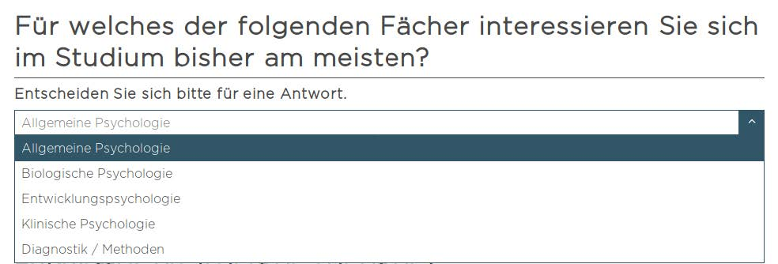
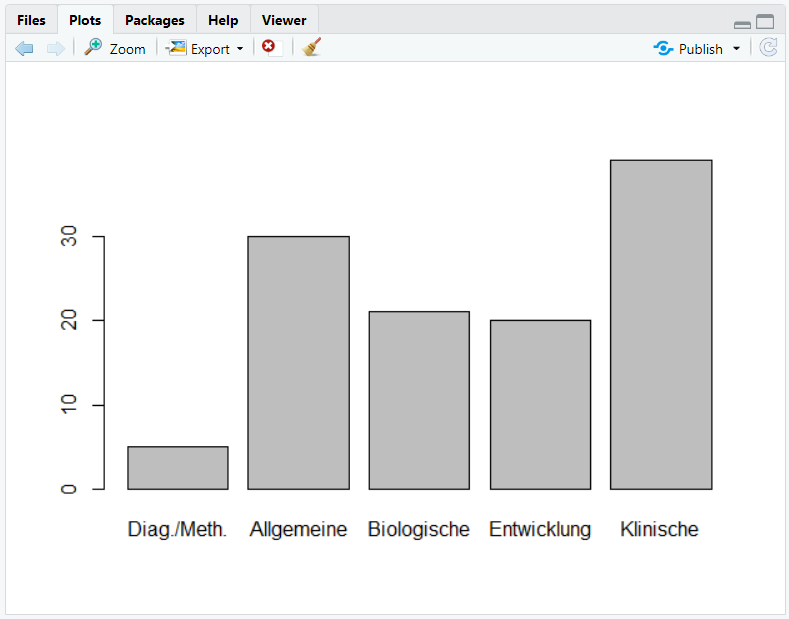
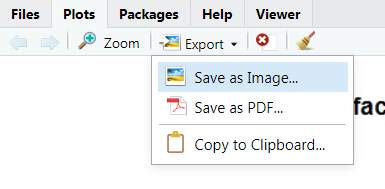
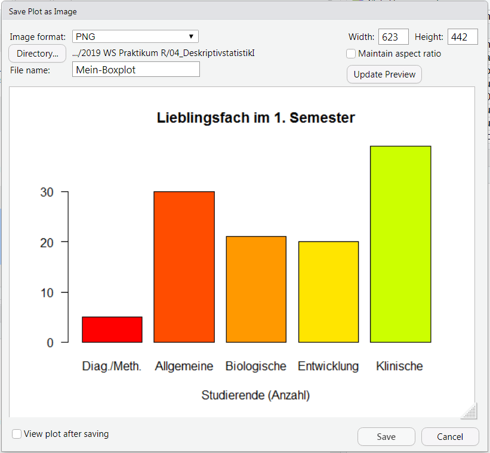
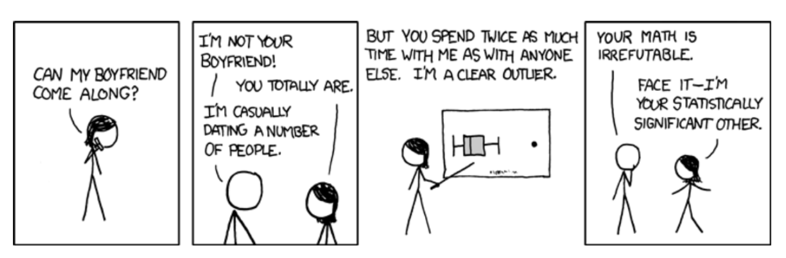
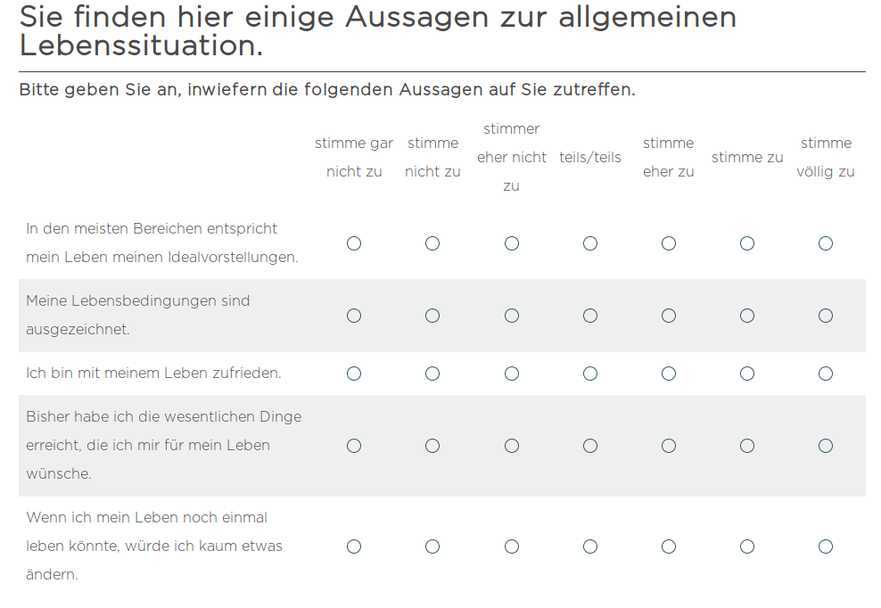

```{r setup, cache = FALSE, echo = FALSE, warning = FALSE, message = FALSE}
knitr::opts_chunk$set(error = TRUE)
library(knitr)
```


## Kernfragen dieser Lehreinheit: 

* Wie werden **Häufigkeitstabellen** erstellt?  
* Wie können aus absoluten Häufigkeitstabellen **relative Häufigkeitstabellen** gemacht werden?  
* Wie können **Modus und Median** bestimmt werden?  
* Auf welche Weise lässt sich der **relative Informationsgehalt** bestimmen, obwohl es dafür in R keine Funktion gibt?  
* Welche Befehle können genutzt werden, um **Balken- und Kuchendiagramme** zu erzeugen?  
* Welche Möglichkeiten gibt es, um **Grafiken anzupassen**?  
* Wie können **Grafiken gespeichert** werden?
* Wie können in R **Histogramme** erstellt werden? Wie lassen sich die Kategorienbreiten verändern?
* Was ist der Befehl um den **Mittelwert** zu bestimmen?
* Wie kann die **empirische Varianz** bestimmt werden? Wie unterscheidet sich diese von der mit `var()` bestimmten Varianz?
* Wie können Variablen **zentriert und standardisiert** werden?
* Welche Möglichkeiten gibt es, negativ formulierte Items zu **rekodieren**?
* Mit welchen Befehlen können in R **Skalenwerte** für Fragebögenitems erstellt werden?


***

## Wiederholung aus der Vorlesung: Skalenniveaus 

Skala | Aussage | Transformation | Zentrale Lage | Dispersion |
--- | ------------ | -------- | ---------- | ----------------- |
Nominal | Äquivalenz | eineindeutig | Modus | Relativer Informationsgehalt |
Ordinal | Ordnung | monoton | Median | Interquartilsbereich |
Intervall | Verhältnis von Differenzen | positiv linear | Mittelwert | Standardabweichung, Varianz |
Verhältnis | Verhältnisse | Ähnlichkeit | ... | ... |
Absolut | absoluter Wert | Identität | ... | ... |


***

## Vorbereitende Schritte

```{r}
load('fb19.rda')   # Daten laden
names(fb19)        # Namen der Variablen
dim(fb19)          # Anzahl Zeile und Spalten
```

Der Datensatz hat also `r nrow(fb19)` Beobachtungen auf `r ncol(fb19)` Variablen.


***

## Nominalskalierte Variablen

Typische Beispiele für nominalskalierte Variablen in der Psychologie sind das Geschlecht (z.B. Variable "geschl" in `erstis`), die Experimentalbedingung (z.B. "UV" und "AV"), die Gruppenzugehörigkeit, ... Nominalskalierte Variablen sollten in `R` als **Faktoren** hinterlegt werden. Faktoren in `R` sind Vektoren mit einer vorab definierten Menge an vorgegebenen möglichen Ausprägungen. Sowohl numerische als auch character-Variablen können als Faktor kodiert werden, was mit jeweiligen Vorteilen einhergeht: 

* für numerische Variablen: es können (aussagekräftige) Labels zugewiesen ("hinterlegt") werden. Diese werden dann für Tabellen und Grafiken übernommen    
* Für character-Variablen: Faktoren können für Analysen verwendet werden (z.B. als Prädiktoren in einer Regression), was für character-Variablen nicht möglich gewesen wäre  

Jeder numerischen Faktorstufe (level) kann ein Label zugewiesen werden. Faktorstufe und –label bestehen auch dann, wenn die entsprechende Ausprägung empirisch nicht auftritt.

**Beispiel 1: Die (numerische) Variable `geschl` als Faktor aufbereiten**

```{r}
str(fb19$geschl)
fb19$geschl
```

Die Variable `geschl` liegt numerisch vor, es treten die Werte 1 und 2 empirisch auf. Anhand des Kodierschemas (Datei **Variablenübersicht.docx**) kann den Zahlen eine inhaltliche Bedeutung zugewiesen werden. Beispielsweise bedeutet der Wert 1 "weiblich". Diese *Label* werden nun im Faktor hinterlegt. 

Vorgehensweise:   

* Erstellung einer neuen Variable im Datensatz per Objektzuweisung: `datensatz$neueVariable <- factor(...)`  
* Faktor erstellen mit der Funktion `factor( Ausgangsvariable , levels = Stufen , labels = Label )`  
* Spezifikation der Faktorstufen im Argument `levels`, also der numerischen Ausprägungen auf der Ursprungsvariable (hier: 1, 2, und 3)  
* Spezifikation des Arguments `labels`, also die Label für die in `levels` hinterlegten numerischen Stufen (hier: "weiblich", "männlich", "anderes"; unbedingt auf gleiche Reihenfolge achten!)

```{r} 
fb19$geschl_faktor <- factor(fb19$geschl,                                   # Ausgangsvariable
                             levels = 1:3,                                  # Faktorstufen
                             labels = c("weiblich", "männlich", "anderes")) # Label für Faktorstufen
str(fb19$geschl_faktor)
head(fb19$geschl_faktor)
```


**Beispiel 2: Lieblingsfach (numerisch) als Faktor aufbereiten**

Analog dazu wird nachfolgend die ebenfalls numerische Variable `fach` in einen Faktor umgewandelt. Sie wurde wie folgt erhoben:

```{r  out.width = "75%", fig.align='center', echo=F}
 
```

```{r}
fb19$fach
```

Es treten die Ausprägungen 1 bis 5 empirisch auf. Auch hier werden die Label aus dem Kodierschema zugewiesen. 

```{r}
fb19$fach <- factor(fb19$fach, 
                    levels = 1:5,
                    labels = c('Allgemeine', 'Biologische', 'Entwicklung', 'Klinische', 'Diag./Meth.'))
str(fb19$fach)
```

Hinweis: In Beispiel 2 wurde die Ursprungsvariable mit dem Faktor überschrieben. Sie ist nun verschwunden, der Datensatz enthält nur noch den Faktor, nicht mehr die numerische Variable. 


**Beispiel 3: Einen character-Vektor als Faktor aufbereiten**

Um einen character-Vektor in einen Faktor umzukodieren, kann die Funktion `as.factor()` verwendet werden (siehe Skript zur Lehreinheit 1). Die Ausprägungen werden dann automatisch als Labels übernommen. Die Stufen (`levels`) werden in alphabetischer Reihenfolge vergeben.

Nachfolgend wird zur Illustration die offenene Freitextantwort zum Grund für das Psychologiestudium (Variable `grund`) in einen Faktor umgewandelt. Dies ist nicht sinnvoll, da jede einzelne Freitextantwort vermutlich nur genau einmal vorkommt und später sowieso nicht (ohne zusätzliche Kodierung) in statistischen Analysen weiterverwendet werden kann.

```{r}
str(fb19$grund)                            # Ursprungsvariable: Character
fb19$grund_faktor <- as.factor(fb19$grund) # Umwandlung in Faktor
str(fb19$grund_faktor)                     # neue Variable: Faktor
```


**Hinweise zu den Levels und Labels**

Die Reihenfolge von Levels und Labels ergibt sich während der Faktorerstellung: 

* bei numerischen Variablen: entspricht den Ausprägungen der numerischen Ursprungsvariable  
* bei character-Variablen: entspricht der alphabetischen Reihenfolge der Ausprägungen auf der Ursprungsvariable  

Die Labels eines Faktors können mit der Funktion `levels()` abgerufen werden. Die Reihenfolge kann mithilfe der `relevel()`-Funktion geändert werden. Dafür muss dasjenige Label angesprochen werden, das die erste Position einnehmen soll (hier: 'Diag./Meth.').

```{r}
levels(fb19$fach)         # Abruf

fb19$fach <- relevel(
  fb19$fach,              # Bezugskategorie wechseln
  'Diag./Meth.')          # Neue Bezugskategorie
```

***

## Häufigkeitstabellen

Eine deskriptivstatistische Möglichkeit zur Darstellung diskreter (zählbarer) nominalskalierter Variablen sind Häufigkeitstabellen. Diese können in `R` mit der Funktion `table()` angefordert werden.


**Absolute Häufigkeiten**

```{r}
table(fb19$fach)
```

Häufig sind relative Häufigkeiten informativer. Nachfolgend werden zwei Möglichkeiten zur Erstellung von relativen Häufigkeitstabellen in `R` gezeigt.


**Relative Häufigkeiten (manuell)**

Relative Häufigkeiten können aus absoluten Häufigkeiten abgeleitet werden: $h_j = \frac{n_j}{n}$. 

Diese einfache Rechenvorschrift (Kategorienhäufigkeit geteilt durch Gesamthäufigkeit) kann auf das gesamte Tabellenobjekt angewendet werden. So wird jede einzelne absolute Kategorienhäufigkeit am Gesamtwert relativiert, es resultiert eine Tabelle der relativen Häufigkeiten.

```{r}
tab <- table(fb19$fach) # Absolute Haeufigkeiten
sum(tab)                # Gesamtzahl
tab / sum(tab)          # Relative Haeufigkeiten
```

**Relative Häufigkeiten (per Funktion)**

Alternativ kann die Funktion `prop.table()` auf das Tabellenobjekt mit den absoluten Häufigkeiten angewendet werden.

```{r}
tab <- table(fb19$fach) # Absolute
prop.table(tab)         # Relative
```

Nicht einmal 5% Ihres Jahrgangs geben als Lieblingsfach "Diagnostik/Methoden" an! Vielleicht können wir Sie mit dem nächsten Thema begeistern. :-)

***

## Grafiken in `R`

Die Darstellung als Tabelle wirkt häufig langweilig. Zu viele Tabellen in einem Bericht / einer Arbeit schrecken Leser meist ab. Nachfolgend werden grafische Darstellungsformen für diskrete nominalskalierte Variablen gezeigt.


**Säulen- oder Balkendiagramm**

```{r, eval=F}
barplot(tab)
```

Die Grafik erscheint in der RStudio-Standardansicht "unten rechts" im Reiter "Plots":

```{r, out.width="60%", fig.align="center", echo=FALSE}

```


**Kuchendiagramm**

```{r, out.width="60%", fig.align="center"}
pie(tab)
```


**Zusatzargumente für Plots**

Die Funktionen zur Erstellung sehr einfacher Grafiken sind also denkbar einfach - die Grafiken selbst aber zunächst nicht unbedingt hübsch. `R` bietet diverse Zusatzargumente zur Anpassung der Optik von Grafiken.

Argument | Bedeutung
--: | :--------
main | Überschrift
las | Schriftausrichtung (0, 1, 2, 3)
col | Farbenvektor
horiz | Horizontale Balkenausrichtung (TRUE/FALSE)
legend.text | Beschriftung in der Legende
xlim, ylim | Beschränkung der Achsen
xlab, ylab | Beschriftung der Achsen


**Farben in `R`**

`R` kennt eine ganze Reihe vordefinierter Farben ($N = 657$) mit teilweise sehr poetischen Namen. Diese können mit der Funktion `colors()` (ohne Argument) abgerufen werden. Hier sind die ersten 20 Treffer:

```{r}
colors()[1:20]
```

Die Farben aus der Liste können als Zahl (Index) oder per Name angesprochen werden. Eine vollständige Liste der Farben findet sich zum Beispiel unter [http://www.stat.columbia.edu/~tzheng/files/Rcolor.pdf](http://www.stat.columbia.edu/~tzheng/files/Rcolor.pdf). Farben können aber auch per RGB-Vektor (Funktion `rgb()`) oder HEX-Wert angesprochen werden.

Zusätzlich können Farbpaletten verwendet werden. Sie bestehen aus einem Farbverlauf, aus dem einzelne Farben "herausgezogen" werden, wodurch ein zusammengehöriges Farbthema in einer Abbildung entsteht. `R` liefert einige dieser Paletten: `rainbow(...)`, `heat.colors(...)`, `topo.colors(...)`, ... Die Farbpalette wird ebenfalls per `col`-Argugment spezifiziert. Technisch handelt es sich um eine Funktion, für die als Argument die Anzahl der Farben spezifiziert werden muss, die aus der Palette "gezogen" werden sollen. Beispielsweise werden mit `col = rainbow(5)` fünf Farben aus der rainbow-Palette gezogen.


**Beispiel für angepasste Abbildung**

```{r}
barplot(tab,
 col = rainbow(20),
 xlab = 'Studierende (Anzahl)',
 main = 'Lieblingsfach im 1. Semester', 
 las=1)
```


**Grafiken speichern**

Es gibt zwei Möglichkeiten, um in `R` erzeugte Grafiken als Bilddatei zu speichern: manuell und per Funktion.  

*Möglichkeit 1: Manuelles Speichern*

Klicken Sie auf die Schaltfläche "Export" und dann auf "Save as Image"...

```{r, echo=F, fig.align='center'}

```

...und spezifizieren Sie dann Dateiname (ggf. Pfad) und Größe/Größenverhältnis. 

```{r, echo=F, fig.align='center'}

```

Wenn kein Pfad spezifiziert wird, erscheint die Datei in Ihrem aktuellen Arbeitsverzeichnis.

```{r, echo=F, fig.align='center'}

```

*Möglichkeit 2: Speichern mit der Funktion `jpeg("Dateiname.jpg")`*

Die Grafikerstellung folgt auf die `jpeg()`-Funktion und wird mit der Funktion `dev.off()` abgeschlossen.

```{r, eval = FALSE}
jpeg("Mein-Boxplot.jpg", width=15, height=10, units="cm", res=150)
barplot(tab,
 col = rainbow(20),
 xlab = 'Studierende (Anzahl)',
 main = 'Lieblingsfach im 1. Semester', 
 las=1)
dev.off()
```

Auch hier gilt: Wenn kein Pfad spezifiziert wurde, liegt die Datei in Ihrem Arbeitsverzeichnis. In der Funktion `jpeg()` kann mit den Argumenten `width`, `height`, `units` und `res` Größe, Größenverhältnis und Auflösung gesteuert werden.


***

## Deskriptivstatistische Kennwerte auf Nominalskalenniveau

**Modus**

Der Modus (*Mo*) ist ein Maß der zentralen Tendenz, das die häufigste Ausprägung einer Variablen anzeigt. Die Häufigkeiten sind ja schon in der Häufigkeitstabelle enthalten. Man könnte den Modus also einfach ablesen. Das gleiche lässt sich allerdings auch anhand von Funktionen tun:  

```{r}
tab            # Tabelle ausgeben
max(tab)       # Größte Häufigkeit
which.max(tab) # Modus
```

Der Modus der Variable `fach` lautet also `r names(which.max(tab))`, die Ausprägung trat `r max(tab)` mal auf.


**Relativer Informationsgehalt**

Der relative Informationsgehalt ist ein Dispersionsmaß, das schon auf Nominalskalenniveau funktioniert. Dafür gibt es in `R` allerdings keine Funktion! Aus Lehreinheit 1 wissen Sie jedoch, dass `R` als Taschenrechner genutzt werden kann, folglich können beliebig komplexe Gleichungen in `R` umgesetzt werden. Die Formel zur Berechnung des relativen Informationsgehalts $H$ lautet:

$$H = -\frac{1}{\ln(k)} \sum_{j=1}^k{h_j * \ln h_j} $$

$n_j$ bezeichnet alle gültigen Antworten und kann als Summe der Häufigkeiten in `tab` abgelesen werden.

```{r}
hj <- prop.table(tab)       # hj erstellen
ln_hj <- log(hj)            # Logarithmus bestimmen
ln_hj                       # Ergebnisse für jede Kategorie
summand <- ln_hj * hj       # Berechnung für jede Kategorie
summe <- sum(summand)       # Gesamtsumme
relinf <- -1/log(5) * summe # Relativer Informationsgehalt
relinf
```

Eine alternative Schreibweise, die ohne Zwischenschritte auskommt, dafür aber stark verschachtelt ist, lautet: 

```{r}
- 1/log(5) * sum(prop.table(table(fb19$fach)) * log(prop.table(table(fb19$fach))))
```

Der relative Informationsgehalt der Variable `fach` beträgt demnach `r round(relinf, 3)`.


***

## Ordinalskalierte Variablen

In diesem Abschnitt lernen Sie deskriptivstatistische Kennwerte für ordinalskalierte Variablen kennen. Aus der Vorlesung wissen Sie schon, dass Median und Interquartilsabstand (IQB) nur für die Klasse der geordneten Kategorien (auch "Rangklassen") sinnvoll sind, nicht für singuläre Daten ("Rangwerte").

Zunächst aber eine Wiederholung: Wie Sie aus der Vorlesung wissen, könnnen die in der Tabelle am Anfang dieses Dokuments aufgeführten statistischen Kennwerte (Zentrale Lage, Dispersion) auch für Skalenniveaus genutzt werden, die "weiter unten" in der Tabelle stehen. Für ordinalskalierte Variablen (Rangklassen) kann also auch der Modus berechnet werden.

Nachfolgend soll mit Item 4 des mdbf gearbeitet werden. Es wurde wie folgt erhoben: 

```{r  out.width = "75%", fig.align='center', echo=F}
 
```

Es treten die Werte 1 bis 4 empirisch auf, außerdem gibt es einen fehlenden Wert (dargestellt als `NA`):

```{r}
fb19$mdbf4
```

Wiederholung: 

```{r}
table(fb19$mdbf4)               # Absolute Haeufigkeiten
prop.table(table(fb19$mdbf4))   # Relative Haeufigkeiten
which.max(table(fb19$mdbf4))    # Modus
```


**Fehlende Werte**

Fehlende Werte in empirischen Untersuchungen können aus vielen Gründen auftreten:  

  * Fragen überlesen / nicht gesehen  
  * Antwort verweigert  
  * Unzulässige Angaben gemacht (im Papierformat)  
  * Unleserliche Schrift (im Papierformat)
  * ...  

Für statistische Analysen sind fehlende Werte ein Problem, weil sie außerhalb der zulässigen Antworten liegen.  


**Fehlende Werte in `R`**

Fehlende Werte werden im Datensatz als `NA` dargestellt. In `R` kann man solche Fälle auf zwei unterschiedlichen Ebenen berücksichtigen: 

* Global: `na.omit(datensatz)`  
    * Entfernt *alle* Beobachtungen, die auf *irgendeiner* Variable einen fehlenden Wert haben  
    * Häufig auch "listenweiser Fallausschluss" gennant  
* Lokal: `na.rm = TRUE`  
    * Das Argument `na.rm` ist in vielen Funktionen für univariate Statistiken enthalten  
    * Per Voreinstellung wird `NA` als Ergebnis produziert, wenn fehlende Werte vorliegen  
    * Fehlende Werte werden nur für diese eine Analyse ausgeschlossen, Datensatz bleibt erhalten  
  

***

## Deskriptivstatistische Kennwerte ab Ordinalskalenniveau

**Median für ordinalskalierte Variablen**

```{r}
median(fb19$mdbf4)                 # Ohne Argument für NA: funktioniert nicht
median(fb19$mdbf4, na.rm = TRUE)   # Expliziter Ausschluss: funktioniert
```

Der Median für die Variable `mdbf4` beträgt also `r median(fb19$mdbf4, na.rm = TRUE)`.

**Quantile und IQB**

Für eine Beschreibung der Dispersion wird häufig der Interquartilsbereich (IQB) genutzt. IQB ist der Bereich zwischen dem 1. und dem 3. Quartil. Auch dafür gibt es keine Funktion in `R`, das Dispersionsmaß kann aber einfach "per Hand" selbst berechnet werden:

$$IQB = Q_3 - Q_1$$

Um die Quartile oder jedes beliebige andere Quantil einer Verteilung zu erhalten, kann die Funktion `quantile()` verwendet werden:

```{r}
quantile(fb19$mdbf4,
         c(.25, .5, .75),                   # Quartile anfordern
         na.rm = T)
```

Zur Berechnung des IQB wird nun die Differenz aus drittem und ersten Quartil gebildet: 

```{r}
quantile(fb19$mdbf4, .75, na.rm=T) - quantile(fb19$mdbf4, .25, na.rm=T) 
```

Der IQB der Variable `mdbf4` beträgt `r quantile(fb19$mdbf4, .75, na.rm=T) - quantile(fb19$mdbf4, .25, na.rm=T)`. 


***

## Boxplots

Eine geeignete grafische Darstellungsform für (mindestens) ordinalskalierte Daten ist der Boxplot. Er kann über die Funktion `boxplot()` angefordert werden:

```{r}
boxplot(fb19$mdbf4)
```

Zur Erinnerung:

* Box: Quartile  
* Whisker: der jeweils extremste empirische Wert im Bereich `Q3 + 1.5*IQB` für das Maximum bzw. `Q1 - 1.5*IQB` für das Minimum  
* Noch extremere Werte werden als Punkte dargestellt  

In diesem Beispiel betragen Median und Q3 jeweils 2, sodass sich die entsprechenden Linien überlagern. Ein  Beispiel für einen "schöneren" Boxplot (ohne Überlagerung) ist dieses:

```{r}
boxplot(fb19$mdbf2)
```

Auch ein Boxplot kann grafisch angepasst werden. Nachfolgend sehen Sie ein Beispiel, in dem möglichst viel verändert wurde, um die verschiedenen Möglichkeiten aufzuzeigen. Nicht alle Veränderungen sind unbedingt sinnvoll.

```{r}
boxplot(fb19$mdbf2,
        horizontal = TRUE,
        main = "WS 2019/2020: Item mdbf1",
        xlab = "Ausprägung",
        las = 1,
        width = 2, 
        notch = TRUE,
        border = "red",
        col = "pink1")
```


***

### Kurzer Exkurs :-)

```{r eval=F}
install.packages("RXKCD")
library("RXKCD")
searchXKCD("significant")
getXKCD(539)
```

```{r out.width = "75%", fig.align='center', echo=F}
 
```


***

## Kardinalskalierte Variablen

### Klassische kardinalskalierte Variablen

* Behaviorale Maße: Reaktionszeiten, Bearbeitungsdauer, Anzahl von Fehlern, ...
* Biologische Maße: Hautleitfähigkeit, Stimmhöhe, Anzahl der Sakkaden, ...
* Neurophysiologische Maße: EEG-Daten, Durchblutung von Hirnregionen, ...


### Konstruierte kardinalskalierte Variablen

* Fragebogendaten werden meist ordinalskaliert erhoben (einzelne Items)
* Um Intervallskalenniveau zu erreichen werden Items zu Skalenwerten verrechnet (Summe oder Mittelwert)
* Erzeugt viele mögliche Ausprägungen und wird als intervallskaliert behandelt


#### Beispiel: Lebenszufriedenheit

```{r  out.width = "75%", fig.align='center', echo=F}
 
```

Der Mittelwert pro Person über alle 5 Items ist in der Spalte `lz` zu finden:

```{r}
fb19$lz
```

## Deskriptivstatistik für kardinalskalierte Variablen

* Verfahren sind "rückwärtskompatibel", d.h. alle Berechnungen, die auf nominalskalierte und ordinalskalierte Variablen anwendbar sind, lassen sich auch auf kardinalskalierte Variablen anwenden. 
* Quantile, IQA und Median können weiterhin bestimmt werden 

```{r}
# Minimum & Maximum
range(fb19$lz, na.rm=T) 

# Quartile
quantile(fb19$lz, c(.25, .5, .75), na.rm=T) 

#Box-Whisker Plot
boxplot(fb19$lz) 
```

## Histogramme

* Zusammenfassung von Werten in Klassen (Kategorien, Intervalle)  
* Häufigkeitsverteilung für die kategorisierten Daten erstellen (sekundäre Häufigkeitsverteilung)  
* Achtung! Die Anzahl der Kategorien kann den Eindruck der Daten beeinflussen:  

```{r}
# Histogramm
hist(fb19$lz) 

# Histogramm (20 Kategorien)
hist(fb19$lz, 
     breaks = 20) 

# Histogramm (ungleiche Kategorien)
hist(fb19$lz, 
     breaks = c(1, 3, 3.3, 3.6, 3.9, 4.5, 5, 7)) 
```

## Mittelwert

**Formel:** ${x} = \frac{\sum_{m = 1}^n x_m}{n} = \frac{1}{n} \sum_{m = 1}^n x_m$

```{r}
# Arithmetisches Mittel
mean(fb19$lz, na.rm = TRUE)
```

## Varianz

**Formel:** $s^2_{X} = \frac{\sum_{m=1}^n (x_m - \bar{x})^2}{n}$

```{r}
# Händische Varianzberechnung
sum((fb19$lz - mean(fb19$lz, na.rm = TRUE))^2, na.rm = TRUE) / (nrow(fb19)-1)
```

Achtung! Wir benötigen für die Varianzberechnung `n` (s. Formel)! Wir nutzen hier `nrow(fb19)-1`, weil `nrow(fb19)` nicht das richtige n anzeigt (eine Person hat einen fehlenden Wert, daher die Anzahl an Zeilen minus der eine fehlende Wert = n)


**Kleiner Diskurs zu fehlenden Werten:**

Um zu prüfen, ob und wie viele fehlende Werte eine Variable hat, lässt sich z. B. folgende Syntax verwenden:

```{r}
sum(is.na(fb19$lz))
```

Um die Länge einer Variablen ohne fehlende Werte (also die Anzahl an Beobachtungen auf einer Variablen) zu bestimmen, lässt sich z. B. folgende Syntax verwenden:

```{r}
length(na.omit(fb19$lz))
```

Zur händischen Varianzberechnung können wir daher auch folgende Syntax verwenden:

```{r}
# Händische Varianzberechnung
sum((fb19$lz - mean(fb19$lz, na.rm = TRUE))^2, na.rm = TRUE) / (length(na.omit(fb19$lz)))
```


### Verschiedene Varianzschätzer

Folgendes Ergebnis liefert R, wenn wir die R-Funktion `var()` zur Berechnung der Varianz verwenden:
```{r}
# R-interne Varianzberechnung
var(fb19$lz, na.rm = TRUE)
```

Warum erhalten wir hier einen abweichenden Wert im Vergleich zu unserer händischen Varianzberechnung? 

Die meisten Programme berechnen nicht die empirische Varianz, sondern einen Schätzer der Populationsvarianz:

**Empirische Varianz** 

$s^2_{X} = \frac{\sum_{m=1}^n (x_m - \bar{x})^2}{n}$

**Schätzer der Populationsvarianz**

$\hat{\sigma}^2_{X} = \frac{\sum_{m=1}^n (x_m - \bar{x})^2}{n - 1}$

Um in R die empirische Varianz mithilfe der `var()`-Funktion zu berechnen, kann man die Populationsvarianz nutzen. Multipliziert man sie mit $\frac{n - 1}{n}$ erhält man die empirische Varianz.

```{r}
# Umrechnung der Varianzen
var(fb19$lz, na.rm = TRUE) * (nrow(fb19) - 1) / nrow(fb19)
```

Achtung! Dies funktioniert in unserem Fall wieder nicht, da die Verwendung von `nrow(fb19)`  - wie oben bereits angemerkt - nicht sinnvoll ist: `nrow(fb19)` ist nicht gleich n (eine Person hat einen fehlenden Wert), daher besser:

```{r}
# Umrechnung der Varianzen
var(fb19$lz, na.rm = TRUE) * (length(na.omit(fb19$lz)) - 1) / (length(na.omit(fb19$lz)))
```

Alternativ:
```{r}
# Umrechnung der Varianzen
var(fb19$lz, na.rm = TRUE) * (117 - 1) / 117 
```


## Standardabweichung

Auch bei der Standardabweichung bestimmt R den Populationsschätzer $\hat{\sigma}_{X}$ 

```{r}
# Standardabweichung in R
sd(fb19$lz, na.rm = TRUE) # Populationsschaetzer

# Händische Berechnung der empirischen Standardabweichung
sqrt(sum((fb19$lz - mean(fb19$lz, na.rm = TRUE))^2, 
         na.rm = TRUE) / (length(na.omit(fb19$lz))))
```

## Zentrierung und Standardisierung

Die Variablenzentrierung und -standardisierung lässt sich in R per Hand berechnen...

```{r}
# Zentrierung
lz_c <- fb19$lz - mean(fb19$lz, na.rm = TRUE)
head(lz_c)

# Standardisierung
lz_z <- lz_c / sd(fb19$lz, na.rm = TRUE)
head(lz_z)
```

...oder mit Hilfe bereits existierender Funktionen:

```{r}
## Befehl zum Standardisieren
lz_z <- scale(fb19$lz)
## Befehl zum Zentrieren (ohne Standardisierung)
lz_c <- scale(fb19$lz,
              scale = FALSE) # unterbindet Standardisierung
```

## Skalenwerte

### Wiederholung: Konstruierte kardinalskalierte Variablen

* Fragebogendaten werden meist ordinalskaliert erhoben (einzelne Items)
* Um Intervallskalenniveau zu erreichen werden Items zu Skalenwerten verrechnet (Summe oder Mittelwert)
* Erzeugt viele mögliche Ausprägungen und wird als intervallskaliert behandelt

### Positive & Negative Items

Viele Fragebögen enthalten sowohl positiv als auch negativ forumulierte Items

* ...um die Befragung abwechslungsreich zu gestalten
* ...um das psychologische Konstrukt umfassender zu erheben
* ...um Antworttendenzen leichter identifizieren zu können

Vor der Skalenbildung müssen alle Items in eine Richtung gebracht werden:
**Rekodierung**

#### Beispiel: MDBF

```{r  out.width = "75%", fig.align='center', echo=F}
 
```

Erhebungsinstrument: **M**ehr**d**imensionaler **B**efindlichkeits**f**ragebogen (MDBF)

* 3 Stimmungsdimensionen: gut vs. schlecht, wach vs. müde und ruhig vs. unruhig
* Jeweils zwei positive, zwei negative Adjektive


**Skala gut vs. schlecht:**

Name | Adjektiv | Richtung 
--- | ----- | ------ 
mdbf1 | zufrieden | positiv  
mdbf4 | schlecht | negativ  
mdbf8 | gut | positiv 
mdbf11 | unwohl | negativ  


* Skala soll bei hohen Werten gute Stimmung darstellen    
* Negativ formulierte Items müssen invertiert werden    
* Mögliche Werte von 1 bis 5     
* Hierzu kennen Sie bereits zwei Möglichkeiten (mit den Befehlen und R-Kenntnissen aus den bisherigen Sitzungen...)    

## Rekodierung
### Variante 1: Lineare Transformation
```{r}
fb19$mdbf4_r <- -1 * (fb19$mdbf4 - 6)
head(fb19$mdbf4)
head(fb19$mdbf4_r)
```

* Allgemeine Form: $-1 \cdot (x_m - x_{\max} - 1)$   
* Vorteil: schnell und einfach umsetzbar   
* Nachteil: nur für Invertierung sinnvoll, nicht allgemeiner anwendbar   

*Quizfrage*: Ist dies eine zulässige Transformation für ordinalskalierte Variablen (wie Items)?  
*Antwort*: Ja, denn die Ordnungsrelation bleibt hierbei erhalten!  

### Variante 2: Logische Filter
```{r}
fb19$mdbf11_r[fb19$mdbf11 == 1] <- 5
fb19$mdbf11_r[fb19$mdbf11 == 2] <- 4
fb19$mdbf11_r[fb19$mdbf11 == 3] <- 3
fb19$mdbf11_r[fb19$mdbf11 == 4] <- 2
fb19$mdbf11_r[fb19$mdbf11 == 5] <- 1

head(fb19$mdbf11)
head(fb19$mdbf11_r)
```

* Durch logische Filter Personen auswählen, die auf Originalvariable den relevanten Wert haben  
* Auf rekodierter Variable neuen Wert zuweisen  
* Vorteil: extrem fexibel, jede Transformation möglich  
* Nachteil: umständlich zu schreiben  

## Skalenwerte erstellen

Skalenwerte werden zumeist als Summen oder Mittelwerte der Items erstellt

### Skalenwert gut vs. schlecht

```{r}
# Datensatz der relevanten Variablen
gut_schlecht <- fb19[, c('mdbf1', 'mdbf4_r', 'mdbf8', 'mdbf11_r')]
# Skalenwert in Originaldatensatz erstellen
fb19$gs <- rowMeans(gut_schlecht)
head(fb19$gs)
```

### Nützliche Funktionen in diesem Zusammenhang: 

* `rowMeans()` Mittelwert für jede Zeile (über Variablen)  
* `colMeans()` Mittelwert für jede Spalte (über Personen)  
* `rowSums()` Summe für jede Zeile (über Variablen)  
* `colSums()` Summe für jede Spalte (über Personen)  
