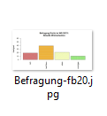

### Vorbereitung

<details><summary>Lösung</summary>

Laden Sie zunächst den Datensatz `fb20` von der pandar-Website.

```{r}
fb20 <- read.table('https://pandar.netlify.app/post/fb20.csv', 
  header = TRUE,
  sep = ',',
  na.strings = '-99')
```

Die Bedeutung der einzelnen Variablen und ihre Antwortkategorien können Sie dem Dokument [Variablenübersicht.docx](/post/variablen.pdf) entnehmen.

Verschaffen Sie sich nun einen Überblick über den Datensatz:

```{r}
dim(fb20)
str(fb20)
```

Der Datensatz besteht aus `r nrow(fb20)` Zeilen (Beobachtungen) und `r ncol(fb20)` Spalten (=Variablen).

</details>


## Aufgabe 1

Untersuchen Sie, welche Arbeitsbranche Sie und Ihre Kommilitonen/innen nach dem Studium anstreben!  

* Vergeben Sie zunächst die korrekten Wertelabels an die Ausprägungen der Variable.  
* Lassen Sie sich absolute und relative Häufigkeiten ausgeben.  
* Untersuchen Sie, mit den geeigneten Maßen, die zentrale Tendenz und Dispersion dieser Variable.  


<details><summary>Lösung</summary>

**Faktor erstellen**

```{r}
fb20$ziel <- factor(fb20$ziel,
                        levels = 1:4,
                        labels = c("Wirtschaft", "Therapie", "Forschung", "Andere"))
levels(fb20$ziel)
```

**Absolute und relative Häufigkeiten anfordern**  

```{r}
table(fb20$ziel)              # absolut
prop.table(table(fb20$ziel))  # relativ
```

**Zentrale Tendenz und Dispersion für nominalskalierte Variablen: Modus, relativer Informationsgehalt**

```{r}
# Modus
which.max(table(fb20$ziel))
```

```{r}
#relativer Informationsgehalt
hj <- prop.table(table(fb20$ziel))  # hj erstellen
ln_hj <- log(hj)                    # Logarithmus bestimmen
summand <- ln_hj * hj               # Berechnung fuer jede Kategorie
summe <- sum(summand)               # Gesamtsumme
k <- length(hj)                     # Anzahl Kategorien bestimmen
relInf <- -1/log(k) * summe         # Relativer Informationsgehalt
relInf
```

Der Modus der Variable lautet 'Therapie' - die meisten Ihres Jahrgangs (*n* = `r max(table(fb20$ziel))` bzw. `r round(max(prop.table(table(fb20$ziel)))*100,2)`%) streben einen Job als Therapeut/-in an. Der relative Informationsgehalt der Variable beträgt `r round(relInf, 2)`.

</details>


## Aufgabe 2

Die Variable `mdbf7` enthält die Angaben über das Ausmaß, in dem Sie und Ihre Kommilitonen/-innen sich zum Zeitpunkt des Ausfüllens "müde" fühlten.  

* Bestimmen Sie für diese Variable den Modus.     
* Untersuchen Sie die Streuung für diese Variable optisch, indem Sie einen Boxplot erstellen.  
* Bestimmen Sie die Quartile und den Interquartilsbereich (IQB) auch als Zahlen.

<details><summary>Lösung</summary>

**Modus**

```{r}
which.max(table(fb20$mdbf7))
```

**Häufigkeiten**

```{r}
table(fb20$mdbf7)
prop.table(table(fb20$mdbf7))
```

Der Modus der Variable "mdbf7" ("müde") beträgt 3, d.h. die Antwortkategorie '3' wurde am häufigsten genannt (*n* = `r max(table(fb20$mdbf7))` bzw. `r round(max(prop.table(table(fb20$mdbf7)))*100,2)`%).

**Boxplot**

```{r}
boxplot(fb20$mdbf7)
```

**Quartile**

```{r}
quantile(fb20$mdbf7, c(.25,.5,.75), na.rm=T)
```

Der Median beträgt `r quantile(fb20$mdbf7, .5, na.rm=T)`. Das 1. und 3. Quartil betragen `r quantile(fb20$mdbf7, .25, na.rm=T)` bzw. `r quantile(fb20$mdbf7, .75, na.rm=T)`. Folglich beträgt der Interquartilsbereich (IQB) `r  quantile(fb20$mdbf7, .75, na.rm=T)-quantile(fb20$mdbf7, .25, na.rm=T)`.

</details>


## Aufgabe 3

Erstellen Sie für die Variable `wohnen` eine geeignete Abbildung.   

* Stellen Sie sicher, dass die einzelnen Ausprägungen der Variable in der Darstellung interpretierbar benannt sind!  
* Dekorieren Sie diese Abbildung nach eigenen Wünschen (z.B. mit einer Farbpalette und Achsenbeschriftungen).
* Speichern Sie die Grafik per Syntax als .jpg-Datei mit dem Namen "Befragung-fb20.jpg" ab.

<details><summary>Lösung</summary>

**Faktor erstellen**

```{r}
fb20$wohnen <- factor(fb20$wohnen, 
                      levels = 1:4, 
                      labels = c("WG", "bei Eltern", "allein", "sonstiges"))
```

**Default Darstellung und überarbeitete Grafik**

```{r}
par(mfrow=c(1,2))

# Default
barplot(table(fb20$wohnen))

# Überarbeitet
barplot(
  # wichtig: Funktion auf Häufigkeitstabelle, nicht die Variable selbst anwenden:
  table(fb20$wohnen),                               
  # aussagekräftiger Titel, inkl. Zeilenumbruch ("\n") 
  main = "Befragung Erstis im WS 20/21:\nAktuelle Wohnsituation", 
  # y-Achsen-Beschriftung:
  ylab = "Häufigkeit",
  # Farben aus einer Farbpalette:
  col = rainbow(10),
  # Platz zwischen Balken minimieren:
  space = 0.1,
  # graue Umrandungen der Balken:
  border = "grey2",
  # Unterscheidlich dichte Schattierungen (statt Füllung) für die vier Balken:
  density = c(50, 75, 25, 50),
  # Richtung, in dem die Schattierung in den vier Balken verläuft
  angle = c(-45, 0, 45, 90),
  # Schriftausrichtung der Achsen horizontal:
  las=2,
  #y-Achse erweitern, sodass mehr Platz zum Titel bleibt:
  ylim = c(0,60))
```

**Speichern (per Syntax)**

```{r, results = "hide"}
jpeg("Befragung-fb20.jpg", width=20, height=10, units="cm", res=200)
barplot(
  table(fb20$wohnen),                               
  main = "Befragung Erstis im WS 20/21:\nAktuelle Wohnsituation", 
  ylab = "Häufigkeit",
  col = rainbow(10),
  space = 0.1,
  border = "grey2",
  density = c(50,75,25,50),
  angle = c(-45,0,45,90),
  las=2,
  ylim = c(0,60))
dev.off()
```

Im Arbeitsverzeichnis ist nun folgende Datei entstanden:  


</details>


## Aufgabe 4

Erstellen Sie im Datensatz `fb20` die Skalenwerte für wach vs. müde (wm) und ruhig vs. unruhig (ru). Diese Skalen umfassen die folgenden Items (negative Items sind unterstrichen):

* Wach vs. müde: ausgeruht (mdbf2), <span style="text-decoration: underline">schlapp (mdbf5)</span>, <span style="text-decoration: underline">müde (mdbf7)</span>, munter (mdbf10)
* Ruhig vs. unruhig: <span style="text-decoration: underline">ruhelos (mdbf3)</span>, gelassen (mdbf6), <span style="text-decoration: underline">unruhig (mdbf9)</span>, entspannt (mdbf12)

Erstellen Sie die Skalenwerte als Mittelwert der jeweiligen vier Items.

<details><summary>Lösung</summary>

**Für wach/müde Items** 

```{r}
# Rekodierung 
# Variante 1: lineare Transformation

fb20$mdbf5_r <- -1 * (fb20$mdbf5 - 6)
fb20$mdbf7_r <- -1 * (fb20$mdbf7 - 6)

# Skalenwert

wach <- fb20[, c('mdbf2', 'mdbf5_r', 'mdbf7_r', 'mdbf10')]
fb20$wm <- rowMeans(wach)
```

**Für ruhig/unruhig Items**

```{r}
# Rekodierung 
# Variante 2: logische Filter

fb20$mdbf3_r[fb20$mdbf3 == 1] <- 5
fb20$mdbf3_r[fb20$mdbf3 == 2] <- 4
fb20$mdbf3_r[fb20$mdbf3 == 3] <- 3
fb20$mdbf3_r[fb20$mdbf3 == 4] <- 2
fb20$mdbf3_r[fb20$mdbf3 == 5] <- 1

fb20$mdbf9_r[fb20$mdbf9 == 1] <- 5
fb20$mdbf9_r[fb20$mdbf9 == 2] <- 4
fb20$mdbf9_r[fb20$mdbf9 == 3] <- 3
fb20$mdbf9_r[fb20$mdbf9 == 4] <- 2
fb20$mdbf9_r[fb20$mdbf9 == 5] <- 1

# Skalenwert

ruhig <- fb20[, c('mdbf3_r', 'mdbf6', 'mdbf9_r', 'mdbf12')]
fb20$ru <- rowMeans(ruhig)
```

</details>


## Aufgabe 5

Bestimmen Sie für beide Skalenwerte jeweils Mittelwert und Median.

* Was vermuten Sie, aufgrund des Verhältnisses der beiden Maße der zentralen Tendenz, bezüglich der Schiefe der Verteilungen?
* Prüfen Sie Ihre Vermutungen anhand von Histogrammen!


<details><summary>Lösung</summary>

```{r}  
# Für wach/müde
median(fb20$wm, na.rm = TRUE)
mean(fb20$wm, na.rm = TRUE)

# Für ruhig/unruhig
median(fb20$ru, na.rm = TRUE)
mean(fb20$ru, na.rm = TRUE)
```

In beiden Fällen ist der Median (geringfügig) größer als der Mittelwert, was auf eine (leicht) linkssteile bzw. rechtsschiefe Verteilung schließen lässt.

**Prüfen der Vermutungen anhand von Histogrammen!**

```{r}  
# Histogramme (nebeneinander)
par(mfrow=c(1,2))
hist(fb20$wm)
hist(fb20$ru)
```

Beide Verteilungen sind tatsächlich (leicht) linkssteil bzw. rechtsschief.

</details>


## Aufgabe 6

Bestimmen Sie für den Skalenwert `wm` die empirische Varianz.

* Ist diese größer oder kleiner als diejenige Schätzung, die mithilfe von `var(...)` bestimmt wird?  
* Warum?  

<details><summary>Lösung</summary>

**Erinnerung:**

* Empirische Varianz: $s^2_{X} = \frac{\sum_{m=1}^n (x_m - \bar{x})^2}{n}$  
* Schätzer der Populationsvarianz: $\hat{\sigma}^2_{X} = \frac{\sum_{m=1}^n (x_m - \bar{x})^2}{n - 1}$  

Zur Berechnung der Varianz gemäß Formel benötigen wir $n$. Wir könnten mit `nrow(fb20)` die Länge des Datensatzes für `n` heranziehen. Dies ist jedoch nur dann sinnvoll, wenn auf der Variable `wm` keine fehlenden Werte vorhanden sind!

```{r}
sum(is.na(fb20$wm))
```

Hier gibt es tatäschlich keine fehlenden Werte, daher ist folgende Formel legitim:

```{r}
# empirische Varianz
# per Hand
sum((fb20$wm - mean(fb20$wm))^2) / nrow(fb20)

# durch Umrechnung 
var(fb20$wm) * (nrow(fb20)-1) / nrow(fb20)

# Populationsschätzer
var(fb20$wm)
```

Die empirische Varianz (`r round(var(fb20$wm)*(nrow(fb20)-1) / nrow(fb20), 3)`) ist kleiner als der Populationsschätzer (`r round(var(fb20$wm),3)`), weil durch `n`, beim Populationsschätzer jeodoch durch `(n-1)` geteilt wird.

</details>


## Aufgabe 7

Erstellen Sie eine z-standardisierte Variante der wach vs. müde Skala als `wm_z`.

* Erstellen Sie für diese standardisierte Variable ein Histogramm.
* Was fällt Ihnen auf, wenn Sie dieses mit dem Histogramm der unstandardisierten Werte vergleichen?
* Erstellen Sie beide Histogramme noch einmal mit 20 Kategorien.


<details><summary>Lösung</summary>

```{r}
par(mfrow=c(1,2))

# z-Standardisierung
fb20$wm_z <- scale(fb20$wm)

# Histogramme
hist(fb20$wm_z)
hist(fb20$wm)
```

Beim Vergleich der beiden Histogrammen fällt auf, dass sich - aufgrund der R-Voreinstellungen - das Erscheinungsbild fälschlicherweise unterscheidet - eigentlich sollte sich durch die z-Transformation nur Skalierung der x-Achsen-Variable verändern. Tatsächlich aber bestimmt R hier eine unterschiedliche Anzahl von Kategorien. Wir halten diese nun über das `breaks`-Argument konstant:

```{r}  
# Histogramme mit jeweils 20 Kategorien
par(mfrow=c(1,2))
hist(fb20$wm_z, breaks = 20)
hist(fb20$wm, breaks = 20)
```

Die Verteilungen sehen nun tatächlich (fast) gleich aus. 

</details>
