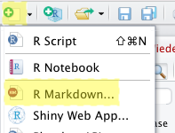
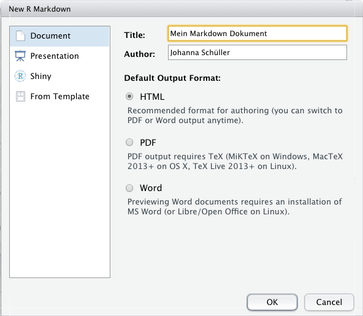
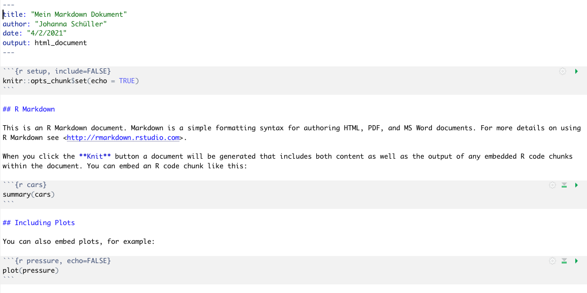
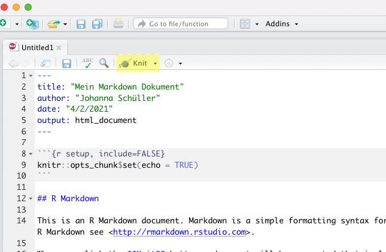
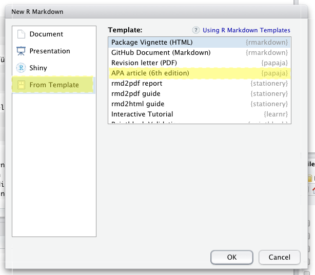

Die praktische Übung um Modul PsyBSc 7 baut auf Grundlagen in R auf, die Sie im letzten Semester erlernt haben. Hier sind nochmal die wichtigsten Grundlagen zusammengefasst. Wenn Sie eine umfassendere Auffrischung der Inhalte des letzten Semesters benötigen oder sich gerne auf die Datenanalyse in R einstimmen möchten, können Sie jederzeit über Pandar auf die Inhalte von PsyBSc 2 zurückgreifen, und beispielsweise nochmal den [R-Crashkurs](https://pandar.netlify.com/post/r-crash-kurs/) oder andere Sitzungen bearbeiten.

### Installation

Für den Verlauf dieses Modul benötigen Sie (wie im vorherigen Semester) die Statistiksoftware R und die Benutzeroberfläche R-Studio auf ihrem Rechner. Beide können kostenlos heruntergeladen werden. 

**Downloadlinks:**

R für das Windows-Betriebssystem: [Download von CRAN](https://cran.r-project.org/bin/windows/base/)

R für das Mac-Betriebssystem: [Download von CRAN](https://cran.r-project.org/bin/macosx/)

R-Studio: [Download von der R-Studio Seite](https://rstudio.com/products/rstudio/download/) (Herunterscrollen um Version für Windows oder Mac zu wählen) 

Hier finden Sie außerdem eine ausführliche [Anleitung](https://www.uni-kiel.de/medinfo/lehre/medlife/Installation_instructions_for_R_and_RStudio.pdf) zum Herunterladen und Installieren von R und R-Studio.

### R Ressourcen

Wir können Ihnen im Studium nur so viel beibringen, wie es unsere und Ihre Zeit zulässt. Diese Zeit schwankt von Person zu Person, wir können aber in jedem Fall mit Sicherheit behaupten, dass es nicht genug ist, um Sie auf alle Probleme vorzubereiten, denen Sie im Laufe ihrer akademischen Karriere begegnen werden. Daher ist unser Ziel nicht nur, Ihnen alle für diesen Kurs relevanten Kompetenzen beizubringen, sondern Sie darüber hinaus zu *kompetenten Problemlöser:innen* in Statistik - unter Verwendung von R - zu machen. Nachfolgend wollen wir Ihnen daher einige Tipps & Ressourcen an die Hand geben, die wir Ihnen beim Erlernen, Vertiefen und Problemlösen empfehlen können.

**R ist eine Open-Source-Software.** 
Dies bedeutet auch, dass es online eine Vielzahl von Ressourcen gibt, die Sie beim Lernen nutzen können und sollen. Zum Einen gibt es online sehr viele kostenlose Informationsangeboten (z.B. die [Introduction to R vom R Core Team](https://cran.r-project.org/doc/manuals/r-release/R-intro.pdf), das [R-Cookbook](http://www.cookbook-r.com), das Buch [R for Data Science](https://r4ds.had.co.nz), oder hier eine [Einführung in R für Psychologie-Studierende](https://r-intro.tadaa-data.de/book/was-ist-r.html), sowie teilweise kostenlosen Übungsplattformen (z.B. [Datacamp](https://www.datacamp.com), [Codecademy](https://www.codecademy.com etc.)).
Dazu kommen die sehr aktiven Foren bzw. Communities, wie vorallem [Stack Overflow](https://stackoverflow.com) für R-Programmierung und [Cross Validated](https://stats.stackexchange.com) für allgemeine Statistikfragen. Lernen Sie, diese Ressourcen für sich zu nutzen!

**Fehlermeldungen sind unsere Freunde** 

Bei der Arbeit mit R sind Fehlermeldungen auch für langjährige Anwender:innen Alltag (wirklich!). Sie sollten also eine Frustrationstoleranz aufbauen, und nicht erwarten, eine Aufgabe ohne Fehlermeldungen lösen zu können - das ist nicht das Ziel! (und außerdem unrealistisch...) 
> Vielmehr sollten Sie lernen, Fehlermeldungen *zu verstehen* und daraus zu lernen. Versuchen Sie, nachzuvollziehen, auf welches Element in Ihrem Code sich eine Fehlermeldung bezieht und was der Inhalt besagt. 

Indem Sie Codeelemente separat ausführen, können Sie probieren, eine Fehlerquelle zu isolieren. Oder brechen Sie den Code auf ein einfache Einheit herunter, welche ohne Fehler funktioniert, und fügen Sie nacheinander Elemente hinzu. Testen Sie auch, ob alle Objekte (Datensätze, Vektoren, etc.), die Sie verwenden, das gewünschte Format haben, richtig eingelesen wurden, den richtigen Inhalt haben, versehentlich überschrieben wurden, etc. 
Wenn Sie nicht weiterkommen, versuchen Sie den Text der Fehlermeldung im Internet zu suchen, denn häufig finden Sie Antworten auf Ihre Fragen in den oben genannten Online-Foren!

**Hilfe zur Selbsthilfe**

Lernen Sie, mit der R-internen Hilfefunktion zu arbeiten. Jede Funktion in R hat eine Hilfeseite, auf der die Anwendung dieser Funktion erklärt wird. Die Struktur ist immer ähnlich: Nach einer Beschreibung der Funktion folgen die *Argumente*, also Informationen, die Sie in die Funktion hineingeben können/müssen. Unter *Values* wird der Output aus einer Funktion beschrieben. Diese Informationen helfen Ihnen, die Ergebnisse zu interpretieren. Weiter unten werden meist Beispiele der Verwendung aufgezeigt. Auch wenn es zum Anfang noch schwer ist, versuchen Sie, die Informationen auf diesen Seiten zu verstehen. Irgendwann wird es leichter, versprochen!

Oft gibt es darüber hinaus online noch ausführlichere Informationen zur Anwendung. Beispielsweise gibt es [hier](https://personality-project.org/r/psych/vignettes/intro.pdf) eine ausführliche Anleitung zum Psych-Package, oder auch so genannte Cheatsheets, die eine Übersicht der wichtigsten Befehle zu bestimmten Themen erhalten (hier beispielsweise für [Basics in R](https://www.rstudio.com/wp-content/uploads/2016/05/base-r.pdf)). Lernen Sie, sich *selbstständig* Informationen zu beschaffen, denn auch nach langjähriger Erfahrung mit R wird das immer wieder notwendig sein. Häufig bedeutet die Arbeit an einer komplexen, neuen Fragestellung: Googeln, googeln, googeln... Wir können und wollen Ihnen in der Veranstaltung nicht alle notwendigen Kenntnisse vermitteln (weil das R-Universum so umfangreich ist), aber wir können Ihnen hoffentlich das Handwerkszeug geben, sich selbst zu helfen! Wenn Sie jedoch nicht weiterkommen, dann *fragen Sie sich untereinander*, oder bei den zahlreichen Gelegenheiten in den Zoom-Veranstaltungen, denn es ist noch kein R-Genie vom Himmel gefallen... Generell ist es für Ihr Studium sehr hilfreich, sich frühzeitig ein gutes soziales Netz aufzubauen, in dem Sie sich gegenseitig helfen und unterstützen. Das ist ein wichtiger Prädiktor für Erfolg im Studium (Robbins et al., 2004), und bringt außerdem mehr Spaß! 

**Documentation is key**

Dokumentieren Sie alle Schritte sorgfältig. Strukturieren Sie Ihren Code durch sinnvoll gewählte Überschriften (mittels Kommentarfunktion), sodass Sie auch später wieder verstehen, was Sie beim letzten Mal gemacht haben. Beginnen Sie ganz oben mit dem sogenannten "Set-Up": Titel der Analyse, ggf. Datum, Setzen des Working Directories, Laden der nötigen Pakete, Einlesen der Daten. Kommentieren Sie jeden Schritt sorgfältig und verständlich (spätestens nach zwei Monaten haben Sie sonst garantiert vergessen, was Sie gemeint haben...). Wenn Sie Korrekturen machen, löschen Sie überflüssige Code-Zeilen, um nicht die Übersicht zu verlieren. Achten Sie darauf, dass sich das Working Directory ändert, wenn Sie den Ort eines Ordner auf Ihrem Rechner ändern oder Ordner umbenennen, und passen Sie die Befehle entsprechend an. Zunächst ist die Dokumentation ein zeitaufwändiger Schritt mehr, aber Future-You wird es Ihnen danken. 

```{r, echo=FALSE, out.width = '30%'}

```
<!-- https://i.redd.it/b9e4xbeg40151.jpg Ich habe keine Ahnung, ob das Bild urheberechtlich geschützt ist, und weiß nicht wie ich es herausfinden könnte-->

**Ausprobieren!**

Scheuen Sie sich nicht, viel auszuprobieren. Oft gibt es viele Wege zum Ziel, und durch das Ausprobieren mehrerer Möglichkeiten lernen Sie umso mehr Vorgehensweisen kennen. Suchen Sie gerne nach alternativen Wegen, probieren Sie andere Funktionen aus, laden Packages herunter und probieren Sie, damit zu arbeiten! Haben Sie keine Angst, etwas falsch zu machen. Durch die Dokumentation (s.o.) können Sie jederzeit, wenn etwas schief gegangen ist, zum vorherigen Schritt zurückkehren, und es nochmal probieren (auch das ist Alltag für alle Anwender:innen!). Behalten Sie immer ein Kopie der Rohdaten, die Sie nicht verändert haben, so können Sie beim Ausprobieren nichts kaputt machen! 


### Objekte und Funktionen

#### Objekte
Objekte sind die Elemente, mit denen R arbeiten kann. Das können einzelne Zahlen bis hin zu komplexen Datensätzen sein. Objekte werden in R durch den Zuweisungspfeil (`<-`) oder das Gleichzeichen (`=`) angelegt. 

```{r}
zahl <- 100
zahl = 100
```

Funktionen oder Rechenoperationen können entweder auf ausgeschriebene Zahlen oder auf Objekte angewandt werden.

```{r}
log(100) 
log(zahl)
```

Objekte können unter anderem für einfache Rechenoperationen (`+`, `-`, `*`, `/`, `^`) sowie für logische Abfragen (`==`, `!=`, `>`, `>=`, `<`, `<=`) genutzt werden. [Hier](https://www.statmethods.net/management/operators.html) finden Sie weiterführende Informationen und eine Übersicht zu Rechenoperationen und logischen Abfragen.

#### Funktionen
Funktionen in R haben die Grundstruktur `funktionsname(argument1 = ..., argument2 = ..., argument3 = ...)`. Die Argumente, die eine Funktion erwartet, können mit `args()` abgefragt werden. 

```{r}
args(round)
```

Testen Sie diese Möglichkeit mit anderen Funktionen, die Sie aus dem letzten Semester kennen! Wenn es einen Default-Wert für ein Argument gibt, wird er hier hinter dem `=` angezeigt. Bei `round` sagt uns der Ausdruck `digits = 0`, dass per default auf 0 Nachkommastellen gerundet wird.

```{r}
round(1.2859)
```

Wenn wir diesen Default-Wert überschreiben, können wir stattdessen bspw. auf 2 Stellen runden. 

```{r}
round(1.2859, digits = 2)
``` 

Argumente können durch die korrekte Reihenfolge oder durch explizite Benennung angesprochen werden. Wenn wir beispielsweise in der `round` Funktion die Reihenfolge der Argumente vertauschen, aber den Namen des Argumentes verwenden, funktioniert die Ausführung trotzdem.

```{r round}
round(digits = 2, x = 1.2859)
``` 

Außerdem können Sie mit `?` oder `help()` die Hilfe einer Funktion aufrufen, um sich detaillierte Informationen zu dieser Funktion ausgeben zu lassen. Nutzen Sie diese Möglichkeit immer, wenn Ihnen die Anwendung einer Funktion nicht klar ist. 

### Vektoren und Matrizen 

#### Vektoren 

Mehrere Zahlen werden in R durch den Befehl `c()` zu Vektoren kombiniert:

```{r}
zahlen <- c(8, 3, 4)
```

Wird eine Rechenoperation auf einen Vektor angewandt, so wird die Operation elementeweise vorgenommen. Hier sehen Sie, dass jedes einzelne Element des Vektors `zahlen` mit 3 multipliziert wird. 

```{r}
zahlen * 3
```

Vektoren können unterschiedlicher Art sein:

+--------------------+--------------------+--------------------------------------------------+
| Klasse             | Abkürzung          | Inhalt                                           |
+====================+====================+==================================================+
| `logical`          | `logi`             | `TRUE` oder `FALSE`                              |
+--------------------+--------------------+--------------------------------------------------+
| `numeric`          | `num`              | Nur Zahlen                                       |
+--------------------+--------------------+--------------------------------------------------+
| `character` *      | `chr`              | Jede Kombination aus Zahlen und Buchstaben       |
+--------------------+--------------------+--------------------------------------------------+
| `factor`           |                    | Faktor mit bestimmter Anzahl an Stufen           |
+--------------------+--------------------+--------------------------------------------------+

* character (engl.) = Zeichen

Für einen vorhandenen Vektor kann die Klasse über die Funktion `str()` ermittelt werden. 

```{r}
str(zahlen)
class(zahlen) #alternativer Befehl
```

Ein logischer Vektor entsteht durch eine elementenweise logische Abfrage. Nutzen Sie immer die Funktion `str()`um zu prüfen, ob ein Vektor das erwartete Format hat. 

```{r}
abfrage <- zahlen == 3 #elementenweise logische Abfrage
str(abfrage)
```

Über die Funktion `as.character()` können die Elemente eines Vektors in Zeichen umgewandelt werden. Neben der Angabe `chr` sehen Sie auch, dass die Zahlen nun in Anführungszeichen dargestellt werden. Was passiert, wenn Sie nun probieren, den Vektor mit 3 zu multiplizieren?
```{r}
zeichen <- as.character(zahlen)
str(zeichen)
```

Faktor-Vektoren werden über `as.factor()` erzeugt. Sie repräsentieren dann einen Faktor mit einer bestimmten Anzahl an Faktorstufen. Zunächst können wir hierfür einen numerischen Vektor anlegen, und dessen Klasse ermitteln. 

```{r}
gender <- c(0, 1, 0, 2, 1, 1, 0, 0, 2)
str(gender)
```

Diesen Vektor können wir nun in einen Faktor umwandeln. Die zugewiesenen Werte werden dann nicht mehr als Zahlen verstanden, sondern als Platzhalter für *nominale* Kategorien. Wir sehen den Unterschied, wenn wir mit `str()` die Klasse erfragen. 

```{r}
gender_factor*3 <- as.factor(gender)
str(gender_factor)
```

Wenn Sie nun beispielsweise eine mathematische Funktion auf diesen Vektor anwenden würden, erhalten Sie eine Fehlermeldung. Testen Sie, was passiert, wenn Sie versuchen, den Vektor `gender_factor` mit 3 zu multiplizieren. Nutzen Sie die Möglichkeit, die Klasse eines Objektes zu erfragen (`str()`) deshalb auch, wenn Sie eine Fehlermeldung erhalten, um zu prüfen, ob ein Vektor die richtige Klasse hat.

#### Matrizen

Matrizen sind eine der vier Formen, in der in R mehrere Vektoren in einem gemeinsamen Objekt abgelegt werden können:

+--------------------+--------------------------------------------------------+
| Form               | Inhalt                                                 |
+====================+========================================================+
| `matrix`           | Vektoren der gleichen Länge und Art (zwei-dimensional) |
+--------------------+--------------------------------------------------------+
| `array`            | Vektoren der gleichen Länge und Art (n-dimensional)    |
+--------------------+--------------------------------------------------------+
| `data.frame`       | Vektoren der gleichen Länge                            |
+--------------------+--------------------------------------------------------+
| `list`             | Beliebige Objekte                                      |
+--------------------+--------------------------------------------------------+

Sie können mit dem `matrix()`-Befehl angelegt werden:

```{r}
mat<- matrix(c(7, 3, 9, 1, 4, 6), ncol = 2)
```

Schauen Sie sich die erstellte Matrix an, in dem sie `mat` ausführen. Prüfen sie mit dem Befehl `str()`, von welcher Art die erstellte Matrix ist. 

```{r matrix2}
mat <- matrix(c(7, 3, 9, 1, 4, 6), ncol = 2)
```

Schauen Sie mit dem Befehls `args()`, welche Argumente die Funktion `matrix` erwartet. Erstellen Sie eine eigene Matrix analog zu oben, und nutzen Sie hierbei die konkrete Benennung der Argumente. 

Auf die Elemente innerhalb von Matrizen kann man über die sogenannte Indizierung zugreifen, indem man Zeile und Spalte nach der folgenden Form ansteuert: `[Zeile, Spalte]`. Das Element in der dritten Zeile und der ersten Spalte erreichen wir also über:
```{r}
mat[3, 1]
```

Wie müsste der Befehl lauten, wenn Sie auf die 4 zugreifen wollen? Welche Art Matrix liegt hier vor? Versuchen Sie, eine eigene Matrix mit anderem Inhalt zu erstellen. Was passiert, wenn Sie verschiedene Datentypen (Zahlen, Zeichenfolgen) mischen? 

Die Dimensionen einer Matrix lassen sich bestimmen über: 
```{r}
nrow(mat)
ncol(mat)
dim(mat) #alternativer Befehl
```

Um Matrizen bzw. Vektoren spaltenweise zusammenzufügen kann `cbind()` genutzt werden (analog ist `rbind()` dafür da, zeilenweise zusammenzufügen).

```{r}
mat2 <-  matrix(c(8, 2, 11, 3, 5, 9), ncol = 2)

combined <- cbind(mat, mat2)
combined
```

Von besonderer Bedeutung sind in der Statistik quadratische Matrizen, also Matrizen mit so vielen Zeilen wie Spalten. In der Vorlesung wurden verschiedene Matrixoperationen besprochen. Alle diese Operationen sind auch in R implementiert und über einfache Befehle nutzbar. 

Hier ein Überblick über die in der Vorlesung behandelten Matrixoperationen und ihre Umsetzung in R (`m` steht dabei immer für eine beliebige Matrix):

+---------------------------+------------------+--------------------------------+
| Operation                 | Befehl           | Anmerkungen                    |
+===========================+==================+================================+
| Diagonale                 | `diag(m)`        |                                |
+---------------------------+------------------+--------------------------------+
| Spur                      | `sum(diag(m))`   |alternativ: tr(), psych-Package |
+---------------------------+------------------+--------------------------------+
| Transposition             | `t(m)`           |                                |
+---------------------------+------------------+--------------------------------+
| Symmetrie prüfen          | `isSymmetric(m)` |                                |
+---------------------------+------------------+--------------------------------+
| Einheitsmatrix            | `diag(1, i)`     | `i`: Anzahl der Zeilen/Spalten |
+---------------------------+------------------+--------------------------------+
| Addition                  | `m1 + m2`        |                                |
+---------------------------+------------------+--------------------------------+
| Subtraktion               | `m1 - m2`        |                                |
+---------------------------+------------------+--------------------------------+
| Multiplikation (Skalar)   | `m * x`          | `x`: Skalar                    |
+---------------------------+------------------+--------------------------------+
| Multiplikation (Matrizen) | `m1 %*% m2`      |                                |
+---------------------------+------------------+--------------------------------+
| Inverse                   | `solve(m)`       |                                |
+---------------------------+------------------+--------------------------------+
| Determinante              | `det(m)`         |                                |
+---------------------------+------------------+--------------------------------+

### Packages 

So genannte Packagee (Pakete) stellen zusätzliche Funktionen zur Verfügung, die in base R nicht verfügbar sind. Aktuell sind in dem offiziellen Repository für R über 15.000 ergänzende Packages verfügbar. Sehen Sie sich hier die vollständige [Liste](https://cran.r-project.org/web/packages/) an. Wenn Sie nach einem Package für einen bestimmten Zweck suchen, ist es jedoch leichter, eine konventionelle Suchmaschine zu nutzen.

Einige nützliche Packages für die Anwendung in psychologischer Forschung sind beispielsweise: 

+--------------------+----------------------------------------------------------------------------------------+
| Package            | Inhalt                                                                                 |
+====================+========================================================================================+
| `psych`            | Funktionen für psychologische Forschung; vorallem multivariate Analysen und            |
|                    | Testkonstruktion, z.B. Faktorenanalysen, Reliabilitätsanalyse  (Revelle, 2020)         |
+--------------------+----------------------------------------------------------------------------------------+
| `car`              | Companion to Applied Regression, Funktionen für Regressionsanalysen                    |
|                    | (Fox & Weisberg, 2019)                                                                 |
+--------------------+----------------------------------------------------------------------------------------+
| `ggplot2`          | Erstellen von Abbildungen (siehe Pandar-Session zu [ggplot2](#ggplot2)) (Wickham, 2016)|
+--------------------+----------------------------------------------------------------------------------------+
| `dplyr`            | Bearbeiten von Datensätzen: Zusammenfassen, Strukturieren, Unterteilen und Neuanordnen | 
|                    | von Datensätzen (Wickham et al., 2020)                                                 |
+--------------------+----------------------------------------------------------------------------------------+
| `haven`            | Einlesen und Erstellen von Datensätzen aus SPSS, SAS und Stata (Wickham & Miller, 2020)| 
+--------------------+----------------------------------------------------------------------------------------+
| `BSDA`             | Basic Statistics and Data Analysis  (Arnholt & Evans, 2017)                            |
+--------------------+----------------------------------------------------------------------------------------+


Packages müssen vor der ersten Nutzung zunächst einmal heruntergeladen werden:
```{r, eval = FALSE}
install.packages("psych")
```

Danach muss man ein Package aus der library laden. Dies muss nach jedem Neustart von R erneut erfolgen, damit das Package genutzt werden kann. 

```{r}
library(psych)
```

### Einlesen von Datensätzen

In der praktischen Nutzung bekommt man es mit Datensätzen in den unterschieldlichsten Dateiformaten zu tun. R kann Daten aus sehr vielen Formaten einlesen (.csv, .sav, .txt, .dat, ...). Teilweise müssen dafür spezielle Packages benutzt werden. Häufig empfiehlt sich die Nutzung von csv-Dateien. 
Hier finden Sie eine [Zusammenfassung](https://de.wikibooks.org/wiki/GNU_R:_Datenimport_und_-export) dazu.

Wenn Daten bereits im R-eigenen .rda-Format vorliegen, können diese über den Befehl `load()` oder über `readRDS()` eingelesen werden.

Wenn die Daten lokal auf dem Rechner gespeichert sind, empfiehlt es sich, den betreffenden Ordner als Working Directory zu definieren und auch das Skript dort abzulegen. Die Daten können dann ohne Angabe eines Dateipfades eingelesen werden.

```{r, eval = FALSE}
setwd("Ordnerpfad")
```

```{r}
load("mach.rda")
```

Die hier verwendeten Daten stammen aus dem ["Open-Source Psychometrics Project"](https://openpsychometrics.org/_rawdata/), einer Online-Plattform, die eine Sammlung an Daten aus verschiedensten Persönlichkeitstests zur Verfügung stellt. Auf der Seite kann man die Fragebögen selbst ausfüllen, und so zum Datenpool beitragen. Der hier verwendete Datensatz enthält Items aus einem Machiavellismusfragebogen, den Sie bei Interesse [hier](https://openpsychometrics.org/tests/MACH-IV/) selbst ausfüllen können.

### Mit Datensätzen arbeiten

Einen ersten Überblick über einen Datensatz verschaffen Sie sich beispielsweise mit Funktionen wie `names()`, `head()` oder `summary()` oder der Funktionen `describe()` aus dem psych-Package. Probieren Sie aus, was jede dieser Funktionen ausgibt. Überlegen Sie, wofür diese Informationen nützlich sein könnten.

Um auf einzelne Variablen in einem Datensatz zuzugreifen, kann man das `$`-Zeichen nutzen, und dann Funktionen auf die angesprochene Variable anwenden.

```{r}
mean(mach$TIPI1)
```

Alternativ kann man analog zu oben auch die Indizierung über eckige Klammern nutzen, um eine oder mehrere Variablen oder Beobachtungen auszuwählen.
```{r}
mean(mach[,1]) #Alle Zeilen, erste Spalte
```

Um eine Anzahl an Beobachtungen auszuwählen, die einen bestimmten Wert in einer Variable haben, kann ebenfalls die Indizierung in eckigen Klammern verwendet werden, und kann ggf. mit dem `%in%`-Operator kombiniert werden. 

```{r, eval = FALSE}
mach[mach$voted == 1, ] #Alle Beobachtungen, die im Item "voted" den Wert 1 haben
mach[mach$religion %in% c(1, 2), ] #Alle Beobachtungen, die im Item "religion" entweder 1 oder 2 aufweisen

mach[,1:10] #Auswahl der ersten 10 Variablen
```

### Markdown-Dateien erstellen

Ein R-Markdown ist ein Dokument, welches im R-Editor erstellt wird, und sowohl Textbestandteile als auch R-Code enthalten kann. Dieses Dokument wird in R erstellt und bearbeitet, und kann danach z.B. als Word-, PDF- oder HTML-Datei ausgegeben werden. Ein Markdown besteht aus freien Textbereichen und aus sogenannten R-Chunks (Absätzen mit R-Code). In Textabsätzen können bestimmte Befehle genutzt werden, um die Formatierung des Textes (Überschriften, Fettdruck, etc.) anzupassen. Markdowns sind beispielsweise nützlich, um Berichte über Datenauswertungen zu schreiben, in denen Analysen und deren Beschreibung sowie Interpretation in einem Dokument gebündelt werden. Ergebnisse können direkt in den Text übernommen werden, was viel Arbeit und Fehler sparen kann.

Hier finden Sie eine sehr [ausführliche Anleitung](https://rmarkdown.rstudio.com/lesson-1.html) für die Arbeit mit Markdowns. Hier finden Sie ein sogenanntes [Cheatsheet](https://rstudio.com/wp-content/uploads/2015/06/rmarkdown-german.pdf) für R-Markdown, das viele wichtige Befehle kurz und knapp zusammenfasst.

#### Schritte zur Erstellung eines Markdowns

- File -> New File -> R Markdown 

```{r, echo=FALSE, out.width = '20%'}

```

- Zielformat festlegen (Word, PDF, HTML...) und Titel geben
```{r, echo=FALSE, out.width = '40%'}

```

- Das Skript, das dadurch erstellt wird ist eine Schablone mit Vorlagen für Freitext und R-Chunks und wichtigen Hinweisen für die Erstellung. Hier finden Sie viele Informationen, die Ihnen beim Bearbeiten Ihres Markdowns helfen. Diese Vorlage können Sie ganz einfach weiterbearbeiten, um Ihr eigenes Dokument zu erstellen. 
```{r, echo=FALSE, out.width = '50%'}

```

- Indem Sie auf Knit (engl. "Stricken") klicken, wird das Dokument in Zielformat erstellt. Ohne Änderungen an der Vorlage können Sie das Skript knitten, und sehen schon einmal, wie das finale Dokument aussehen wird. Wenn Sie Änderungen vornehmen, können Sie immer wieder überprüfen, wie sich das auf das erstellte Dokument auswirkt. 
```{r, echo=FALSE, out.width = '50%'}

```

#### Papaja
Besonders hilfreich ist das Package *papaja* (Prepare Reproducible APA Journal Articles with R Markdown), mit dem R Markdown-Dokumente automatisch in das APA-Format gebracht werden. Neben der korrekten Zitierweise können damit Tabellen und Abbildungen im passenden Format erstellt werden. 

Wenn Sie das *papaja*-Package installiert haben, können Sie bei der Erstellung eines Markdowns mit den gleichen Schritten wie oben, unter Template den "APA article" auswählen, wodurch automatisch alle Einstellungen passend vorgenommen werden:

```{r, echo=FALSE, out.width = '50%'}

```

Das [Manual für die Anwendung](http://frederikaust.com/papaja_man/index.html) finden Sie online. 

## Literatur
Arnholt, A. T. & Evans, B. (2017). BSDA: Basic Statistics and Data Analysis. R package version 1.2.0.
  https://CRAN.R-project.org/package=BSDA
Aust, F. & Barth, M. (2020). papaja: Prepare reproducible APA journal articles with R Markdown. R package version 0.1.0.9997.
  Retrieved from https://github.com/crsh/papaja
Fox, J. & Weisberg, S. (2019). An {R} Companion to Applied Regression, Third Edition. Thousand Oaks CA: Sage. URL:
  https://socialsciences.mcmaster.ca/jfox/Books/Companion/
Revelle, W. (2020) psych: Procedures for Personality and Psychological Research, Northwestern University, Evanston, Illinois,
  USA, https://CRAN.R-project.org/package=psych Version = 2.0.9,.
Robbins, S. B., Lauver, K., Le, H., Davis, D., Langley, R., & Carlstrom, A. (2004). Do psychosocial and study skill factors predict college
  outcomes? A meta-analysis. Psychological bulletin, 130(2), 261.
Wickham, H. ggplot2: Elegant Graphics for Data Analysis. Springer-Verlag New York, 2016.
Wickham, H. , Romain François, Lionel Henry and Kirill Müller (2020). dplyr: A Grammar of Data Manipulation. R package
  version 1.0.2. https://CRAN.R-project.org/package=dplyr
Wickham, H. & Miller, E. (2020). haven: Import and Export 'SPSS', 'Stata' and 'SAS' Files. R package version 2.3.1.
  https://CRAN.R-project.org/package=haven


